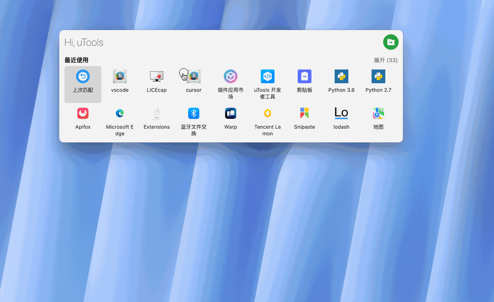

# Open By

一个基于 uTools 的文件（夹）搜索和打开插件，支持在多种编辑器中快速打开文件和文件夹。

## 主要功能

### 功能展示

  

### 1. 多编辑器支持
- 支持在以下编辑器中打开文件/文件夹：
  - 📝 VS Code
  - 🎯 Cursor
  - 🌐 WebStorm
  - 🐍 PyCharm
  - 🔷 GoLand
  - 📱 AppCode

### 2. 快速文件搜索
- 实时搜索结果展示
- 支持同时搜索文件和文件夹
- 支持设置搜索深度（默认3级）
- 可选择是否搜索隐藏文件
- 支持排除指定目录（如 node_modules, .git 等）
- 支持自定义搜索路径

### 3. 智能搜索配置
- 可自定义搜索目录列表
- 可设置搜索深度（1-10级）
- 支持文件类型过滤（文件/文件夹）
- 支持添加和移除排除目录
- 默认从用户主目录开始搜索

### 4. 便捷操作支持
- 支持通过快捷命令直接调用：
  - `code <搜索词>` - 在 VS Code 中打开
  - `cursor <搜索词>` - 在 Cursor 中打开
  - `webstorm <搜索词>` - 在 WebStorm 中打开
  - `pycharm <搜索词>` - 在 PyCharm 中打开
  - `goland <搜索词>` - 在 GoLand 中打开
  - 其他编辑器同理
- 键盘快捷操作：
  - 上下方向键导航搜索结果
  - Enter 键快速打开选中项

## 使用方法

### 1. 基本搜索
- 在 uTools 中输入 `open-by` 或直接使用编辑器命令（如 `code`）
- 输入要搜索的文件或文件夹名称
- 使用上下方向键选择结果
- 按 Enter 键在对应编辑器中打开

### 2. 搜索选项设置
- 点击界面右下角的设置图标 ⚙️
- 可选择搜索类型：
  - ✅ 文件
  - ✅ 文件夹
  - ✅ 隐藏文件（可选）
- 调整搜索深度（默认3级）

### 3. 路径配置
在设置面板中可以配置：
- 搜索路径：添加常用的项目目录
- 排除路径：添加不需要搜索的目录
- 编辑器路径：配置各编辑器的可执行文件路径

### 4. 编辑器路径配置
- 在设置面板中找到"编辑器路径设置"
- 为每个编辑器设置对应的可执行文件路径
- 可以使用"使用默认路径"快速填入推荐路径
- 路径会根据当前操作系统自动保存

## 注意事项

1. 首次使用请先配置：
   - 添加常用的搜索目录
   - 设置编辑器的可执行文件路径
   - 确认排除目录设置是否合适

2. 性能优化建议：
   - 搜索深度建议保持在3-5级
   - 及时清理不需要的搜索路径
   - 合理配置排除目录，避免不必要的搜索

3. 路径说明：
   - 搜索路径支持绝对路径
   - 编辑器路径必须是可执行文件的完整路径
   - 排除路径支持目录名匹配

4. 常见问题：
   - 如果编辑器无法打开，请检查路径配置是否正确
   - 如果搜索结果不理想，可以调整搜索深度或修改搜索路径
   - 如果性能较慢，建议减少搜索深度或增加排除目录

## 支持平台
- ✅ Windows
- ✅ macOS
- ✅ Linux

[下载插件](./open-by-0.0.1.upxs)